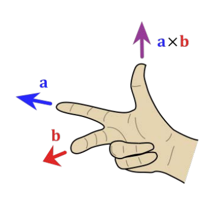
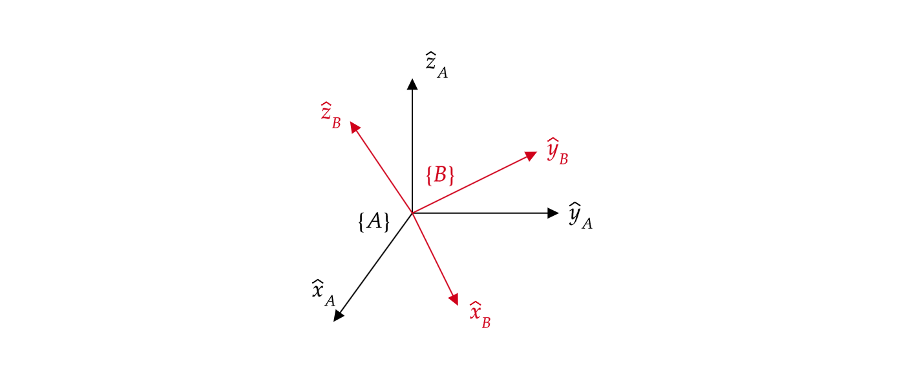
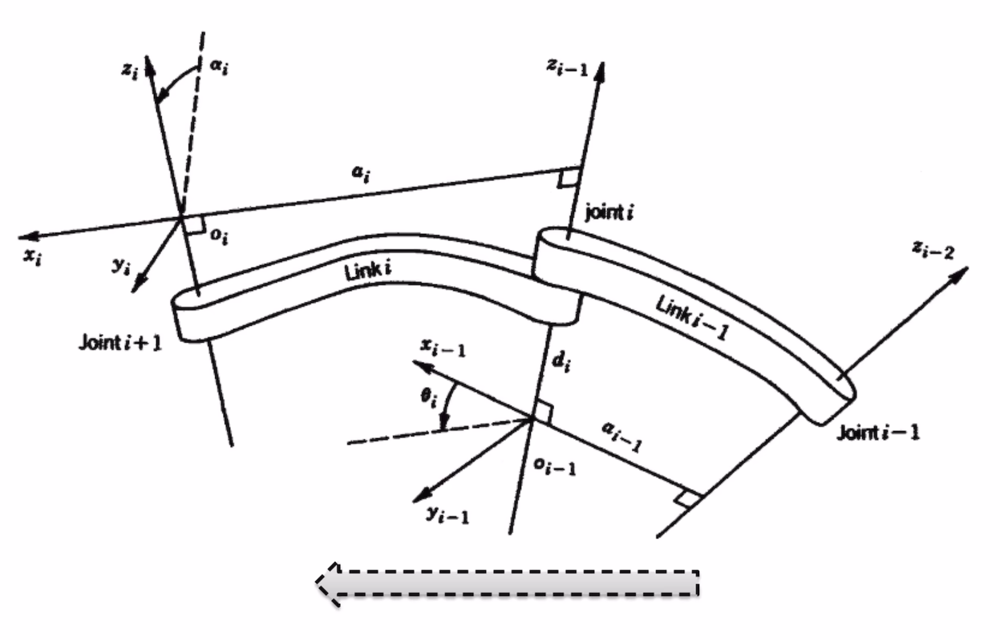
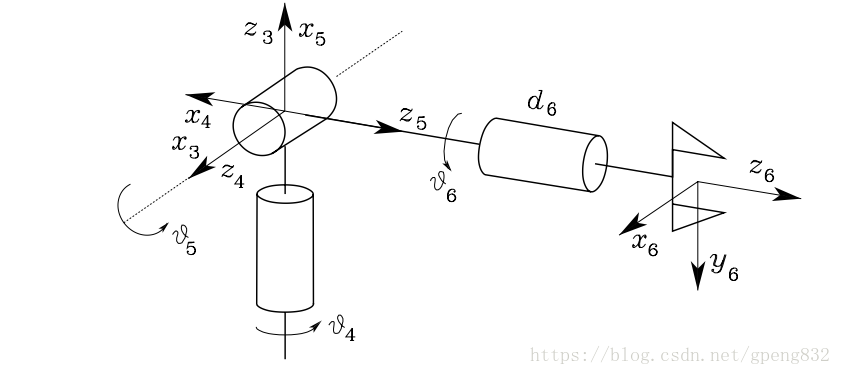

# 机器人学基础及机械臂解算
## 1 机器人学基础
### 1.1 向量叉乘
向量叉乘满足右手定则，如图所示

注意叉乘有前后顺序， $a\times b=-b\times a$

向量叉乘可以被表示为一个线性关系
$$
a\times b = \left[\begin{matrix}
    a_2b_3 - a_3b_2 \\ 
    a_3b_1 - a_1b_3 \\
    a_1b_2 - a_2b_1
\end{matrix}\right] = \left[\begin{matrix}
0 & -a_3 & a_2 \\
a_3 & 0 &-a_1 \\
-a_2 & a_1 & 0
\end{matrix}\right]b = [a]b
$$
每个三维向量 $a$ 都对应一个三维的反对称矩阵 $[a]$ 
$$
[a] = -[a]^T
$$

### 1.2 旋转矩阵
一般规定所有坐标系为右手系，即坐标系的三个正交基向量（三个轴） $\hat x,\hat y,\hat z$ 满足 
$$
\hat x \times \hat y = \hat z
$$

将坐标系 $\{A\}$ 旋转到坐标系 $\{B\}$ 的位置，可以由旋转矩阵 $R$ 表示
$$
^AR_B = \begin{bmatrix}
    {^A\hat x_B} & {^A\hat y_B} & {^A\hat z_B}
\end{bmatrix}
$$

${^A\hat x_B}$ 表示向量 $\hat x_B$ 在坐标系 $\{A\}$ 下的坐标

旋转矩阵的一些性质：
- $R^TR=I$
- $\det(R)=1$
- $SO(n) = \left\{R\in\R^{n\times n}:R^TR = I,\det(R) = 1\right\}$
  
旋转矩阵的物理意义：

1. 表示一个旋转姿态（定义）
2. 在两个参考坐标系之间转换：
   如有一向量$v$，在坐标系 $\{A\}$ 和坐标系 $\{B\}$ 下的坐标为 $^Av,{^Bv}$
   $$
    ^Av = {^AR_B}{^Bv}
   $$
3. 表示一个旋转动作：将A点旋转至A'点
   $$
   {^OR_{A'}} = R{^OR_A}
   $$
   > 左乘，绕着固定轴旋转；右乘，绕着旋转后的轴旋转 （证明较复杂先记住结论）

### 1.3 其他表示旋转的方法
#### 欧拉角
如旋转顺序为ZYZ的欧拉角，依次绕着上次旋转后的轴进行旋转

$$
^0R_1(\alpha ,\beta,\gamma) = R_z(\alpha)R_y(\beta)R_z(\gamma)
$$

ZYX欧拉角，等价与绕定轴旋转的RPY角（roll-pitch-yaw）
$$
^0R_1(\text{yaw,pitch,roll}) = R_z(\text{yaw})R_y(\text{pitch})R_x(\text{roll})
$$ 
### 1.4 变换矩阵
在三维世界中，不仅有旋转动作，还有平移动作，想要完全描述坐标系 $\{A\}$ 和坐标系 $\{B\}$ 的位姿关系，需要旋转矩阵 $^AR_B$ 和 坐标系 $\{B\}$ 的原点在坐标系 $\{A\}$ 中的坐标 $^Ao_B$

对于点 $p$ ,有
$$
^Ap = {^Ao_B} +{^AR_B}{^Bp}
$$

为了将其描述为线性关系，我们将 $p\in \R^3$ 扩展为齐次坐标
$$
\tilde{p} = \begin{bmatrix}
    p \\ 1
\end{bmatrix} \in \R^4
$$
> 对于点，齐次坐标添加1；对于向量，齐次坐标添加0、

定义从坐标系 $\{A\}$ 到坐标系 $\{B\}$ 的变换矩阵
$$
    ^AT_B = \begin{bmatrix}
        {^AR_B} & {^Ao_B} \\
        0 & 1
    \end{bmatrix}
$$

$$
    ^A\tilde{p} = {^AT_B}{^B\tilde{p}}
$$
    
## 2 机械臂运动学
### 1.1 正运动学 DH参数法
- 连杆——link
- 关节——jiont
- 通过每个link的DH参数，可以仅通过关节变量求得相邻两jiont之间的齐次变换矩阵

对每个jiont建立坐标系，指定 $z_i$ 为旋转/平移关节的旋转轴/平动轴；$x_i$ 为 $z_i$ 和 $z_{i-1}$ 的公垂线且与 $z_{i-1}$ 相交，方向由 $z_{i-1}$ 指向 $z_{i}$ ；$y_i$ 遵循右手系规则

DH参数共有四个：

1. 连杆长度 $a_i$ : 沿 $x_i$ 方向， $z_i$ 和 $z_{i-1}$间的距离
2. 连杆扭转 $\alpha_i$ :  $z_i$ 轴和 $z_{i-1}$ 轴的夹角，正方向如图所示，由 $z_{i-1}$ 指向 $z_i$ 轴；
3. 关节偏移 $d_i$ : 沿着 $z_{i-1}$ ,点 $o_{i-1}$ 到 $x_i$ 和 $z_{i-1}$ 交点的距离
4. 关节转角 $\theta_i$ :  $x_i$ 轴和 $x_{i-1}$ 轴的夹角，正方向如图所示，由 $x_{i-1}$ 指向 $x_i$ 轴；

> 对于平动关节来说，$d_i$ 为关节变量，其他为常数

> 对于转动关节来说，$\theta_i$ 为关节变量，其他为常数
>

得到每个关节的DH参数后，可通过计算得到相邻两关节的齐次变换矩阵
$$
^{i-1}T_i = Rot_{z,\theta}Trans_{z,d}Trans_{x,a}Rot_{x,a} = \begin{bmatrix}
    c_\theta & -s_\theta c_\alpha & s_\theta s_\alpha & ac_\theta \\
    s_\theta & c_\theta c_\alpha & -c_\theta s_\alpha & as_\theta \\
    0 & s_\alpha & c_\alpha & d \\
    0 & 0 & 0 & 1
\end{bmatrix}
$$
> 式中 $c_\theta = \cos \theta$ , $s_\theta = \sin \theta$

将每个关节之间的变换矩阵相乘即可得到从基座坐标系到工具坐标系之间的变换矩阵
$$
    ^0T_n = {^0T_1}{^1T_2}{^2T_3}\cdots{^{n-1}T_n}
$$

### 2.2 逆运动学
逆运动学可分为数值迭代法和解析法，一般为了保证能求出解以及实时性，采用几何解析解法。
> 在机械臂结构设计时需要满足一定结构规范，才能保证能够求得解析解
>
#### 2.2.1 标准正交球形腕逆运动学
在大多数六轴机械臂的最后三轴，都会采用球形腕（Spherical Wrist）结构来保证能够达到工作空间中的所有姿态（如苍穹战队RM2024赛季工程机器人机械臂末端）

设现在需要的第三关节到第六关节间的旋转矩阵为
$$
    ^3R_6 = \begin{bmatrix}
        n_x & s_x & a_x \\
        n_y & s_y & a_y \\
        n_z & s_z & a_z 
    \end{bmatrix}
$$

有两组解：

当 $\theta_5\in(0,\pi)$
$$
\theta_4 = Atan2(a_y,a_x) \\
\theta_5 = Atan2(\sqrt{{a_x}^2+{a_y}^2},a_z) \\
\theta_6 = Atan2(s_z,-n_z) \\
$$

当 $\theta_5\in(-\pi,0)$
$$
\theta_4 = Atan2(-a_y,-a_x) \\
\theta_5 = Atan2(-\sqrt{{a_x}^2+{a_y}^2},a_z) \\
\theta_6 = Atan2(-s_z,n_z) \\
$$

证明过程见[Modeling, Motion Planning, and Control of Manipulators and Mobile Robots——Inverse Kinematics](https://opentextbooks.clemson.edu/wangrobotics/chapter/inverse-kinematics/)（链接中有完整的六轴机械臂解算方法）

## 3 机械臂动力学
24赛季未考虑机械臂动力学，使用PID+前馈方式对每个关节进行单独控制，若机械臂结构更复杂则需要考虑动力学补偿，为后续迭代方向，我有空更新

## 4 仿真验证
可以使用MATLAB Robotic toolbox 进行仿真验证